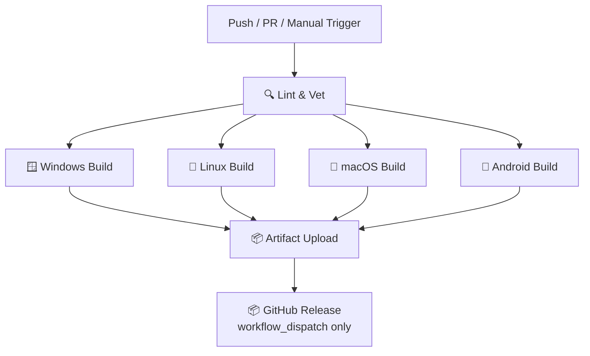

# 🚀 CI Multi-Platform Build Demo

> 演示如何使用 **GitHub Actions** 实现跨平台 CI 自动化构建 — 覆盖 Windows、Linux、macOS 和 Android。

## 📋 项目结构

```
ci-demo/
├── .github/
│   └── workflows/
│       └── ci-multi-platform.yml   ← 🔥 核心：CI 工作流定义
├── app/
│   ├── main.go                     ← Go 命令行工具
│   ├── main_test.go                ← Go 单元测试
│   └── go.mod
├── android/
│   ├── app/
│   │   ├── build.gradle            ← Android 应用构建配置
│   │   ├── proguard-rules.pro
│   │   └── src/main/
│   │       ├── AndroidManifest.xml
│   │       ├── java/com/demo/ci/
│   │       │   └── MainActivity.java
│   │       └── res/values/
│   │           └── strings.xml
│   ├── build.gradle                ← 根 Gradle 配置
│   ├── settings.gradle
│   └── gradle/wrapper/
│       └── gradle-wrapper.properties
├── .gitignore
└── README.md
```

## ⚙️ CI 流水线架构



## 🏗️ 构建目标矩阵

| 平台 | 架构 | 输出格式 | 构建环境 |
|------|------|---------|---------|
| 🪟 **Windows** | amd64, arm64 | `.exe` | `ubuntu-latest` (交叉编译) |
| 🐧 **Linux** | amd64, arm64 | 二进制文件 | `ubuntu-latest` |
| 🍎 **macOS** | amd64 (Intel), arm64 (Apple Silicon) | 二进制文件 | `ubuntu-latest` (交叉编译) |
| 🤖 **Android** | — | `.apk` (Debug + Release) | `ubuntu-latest` + Android SDK |

## 🎯 触发方式

| 事件 | 说明 |
|------|------|
| `push` | 推送到 `main`/`master` 分支时自动触发 |
| `pull_request` | 创建 PR 到 `main`/`master` 时触发 |
| `workflow_dispatch` | 手动触发，可指定版本号 → 自动创建 GitHub Release |

## 🔑 关键 GitHub Actions

工作流中使用的 Actions 及其作用：

| Action | 用途 |
|--------|------|
| [`actions/checkout@v4`](https://github.com/actions/checkout) | 检出代码 |
| [`actions/setup-go@v5`](https://github.com/actions/setup-go) | 安装 Go 工具链 |
| [`actions/setup-java@v4`](https://github.com/actions/setup-java) | 安装 JDK（Android 构建需要） |
| [`android-actions/setup-android@v3`](https://github.com/android-actions/setup-android) | 安装 Android SDK |
| [`actions/upload-artifact@v4`](https://github.com/actions/upload-artifact) | 上传构建产物 |
| [`actions/download-artifact@v4`](https://github.com/actions/download-artifact) | 下载构建产物（Release 用） |
| [`actions/cache@v4`](https://github.com/actions/cache) | 缓存 Gradle 依赖，加速构建 |
| [`softprops/action-gh-release@v2`](https://github.com/softprops/action-gh-release) | 创建 GitHub Release |

## 🚀 快速开始

### 1. Fork / 克隆本项目

```bash
git clone https://github.com/YOUR_USER/ci-demo.git
cd ci-demo
```

### 2. 本地运行 Go 应用

```bash
cd app
go run main.go

# 输出：
# ╔══════════════════════════════════════╗
# ║   CI Multi-Platform Demo App v1.0   ║
# ╚══════════════════════════════════════╝
#   Platform   : windows (or linux/darwin)
#   Architecture: amd64
#   Go Version : go1.21.x
```

### 3. 推送代码触发 CI

```bash
git add .
git commit -m "feat: trigger multi-platform CI build"
git push origin main
```

推送后访问仓库的 **Actions** 标签页查看实时构建状态。

### 4. 手动创建 Release

1. 进入 **Actions** → **🚀 Multi-Platform CI Build**
2. 点击 **Run workflow**
3. 输入版本号如 `v1.0.0`
4. 点击 **Run workflow**

所有平台构建完成后，会自动创建 GitHub Release 并附带全部产物。

## 📊 构建产物

每次构建成功后，可在 **Actions** 运行详情页的 **Artifacts** 区域下载：

- `windows-amd64` — Windows x64 可执行文件
- `windows-arm64` — Windows ARM64 可执行文件
- `linux-amd64` — Linux x64 二进制
- `linux-arm64` — Linux ARM64 二进制
- `macos-amd64` — macOS Intel 二进制
- `macos-arm64` — macOS Apple Silicon 二进制
- `android-apks` — Android Debug + Release APK

## 🔧 关键技术点

### Go 交叉编译

利用 Go 内置的交叉编译能力，在 `ubuntu-latest` 单台 Runner 上编译所有桌面平台：

```yaml
# Windows
GOOS=windows GOARCH=amd64 go build -o app.exe
# Linux
GOOS=linux GOARCH=arm64 go build -o app
# macOS
GOOS=darwin GOARCH=arm64 go build -o app
```

### Android SDK 自动化

使用 `android-actions/setup-android@v3` 自动安装 Android SDK：

```yaml
- uses: android-actions/setup-android@v3
  with:
    packages: "platforms;android-34 build-tools;34.0.0"
```

### 矩阵策略 (Matrix Strategy)

一个 Job 定义，自动生成多份并行构建：

```yaml
strategy:
  matrix:
    arch: [amd64, arm64]
```

### Gradle 缓存

缓存 `~/.gradle` 目录，后续构建无需重复下载依赖：

```yaml
- uses: actions/cache@v4
  with:
    path: ~/.gradle/caches
    key: ${{ runner.os }}-gradle-${{ hashFiles('**/*.gradle*') }}
```

## 📝 许可

MIT
